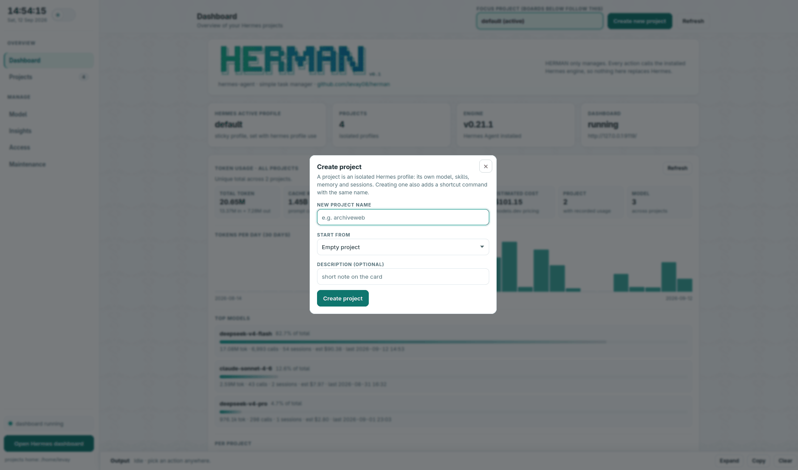

# herman

**hermes-agent · simple task manager**

A small, dependency-free manager for your
[Hermes Agent](https://hermes-agent.nousresearch.com/docs) projects (profiles): one CLI and one local
web panel, on top of the `hermes` binary you already have. It keeps every project in one place
(create, enter, back up, inspect, delete), shows what runs and what each one costs, and reads the
analytics Hermes already writes to `state.db`. It never reimplements the agent: sessions, model
switches and profile changes go through `hermes`, and the settings herman writes itself land in one
project's own `config.yaml` / `.env`, after a backup. It uploads nothing anywhere.

## Why herman is shorter than the engine it wraps

The project is implicit (the one you are working in, else the last one you used), values are
positional, a setting is `key=value`:

| job | hermes | herman |
|---|---|---|
| enter a session | `hermes -p web` | `herman web` |
| switch model | `hermes -p web config set model.default opus` | `herman model opus` |
| switch endpoint | `hermes -p web config set model.base_url URL` | `herman model @URL` |
| enable telegram | `hermes -p web gateway setup` | `herman c tg on` |
| a chat setting | `hermes -p web config set telegram.require_mention false` | `herman c tg require_mention=false` |
| web backend | `hermes -p web config set web.backend exa` | `herman c web backend=exa` |
| a backend key | (edit `.env` by hand) | `herman c web EXA_API_KEY` |
| add an MCP server | `hermes -p web mcp add docs --url URL` | `herman m add docs URL` |
| remove an MCP server | `hermes -p web mcp rm docs` | `herman m rm docs` |
| store an API key | (edit `.env` by hand) | `herman key EXA_API_KEY` |
| project history | `hermes -p web insights` | `herman hist` |
| health check | `hermes -p web doctor` | `herman -d` |

Across the 18 jobs where both CLIs have a verb: hermes 101 words, herman 59. The long spellings keep
working (`herman config web chat telegram --set require_mention=false`); the short ones are what
`herman -h` leads with and what the panel runs when you press a button.

## Requirements

- Hermes Agent on your PATH (`hermes -V`)
- Python 3.9+ (standard library only, no pip)
- Linux or macOS (on Windows use WSL2: herman leans on POSIX signals and `/proc` for live sessions)
- a terminal emulator only for the "open a session window" button

## Install

```sh
git clone https://github.com/levay08/herman.git
cd herman && ./install.sh
```

That copies `~/.local/bin/herman`, `~/.local/share/herman/index.html` and the bash completion.
`./herman -l` and `./herman web` also run straight from the clone.

## CLI

**Projects**

```sh
herman                       dashboard: every project, its model, skills, memory, live session
herman <name>                enter its Hermes session
herman -p <name>             create a project (--clone copies config, keys and skills)
herman -l | -i [name]        list projects / inspect one
herman pin | unpin <name>    keep up to three projects in the first row of the Projects board
herman --rename <old> <new>  rename a project (profile, shortcut command and note follow)
herman -r <name>             delete a project and its profile
herman -d [name|--all]       doctor: read-only health check
herman sync [--fix]          re-check herman against the installed Hermes
herman update [--check]      update herman itself (--dry-run, --no-restart); herman's files only
```

**Sessions, models, history**

```sh
herman kill <name> [session-id]   stop a running session the polite way (SIGINT first, like Ctrl+C)
herman model [name] [<id>]        show, or switch the model; @<url|preset> switches the endpoint
herman model <name> --list | --endpoints | --probe | --set <id> | --provider <p>
herman last [name|--all]          CLOSED sessions (rolling 24 h): the last prompt and the last
                                  result of each — final answer, tool call still in flight, or the
                                  last output when no answer was written (--within, --limit, --json)
herman history <name> --stats     sessions, messages and usage rows (--delete-matching|session|all)
herman --usage [--days N] | -b <name|--all> | -x <file> | --tidy | --logs <name>
herman security                   the panel's security battery: auth carriers, origin and host
                                  guards, POST-only writes, argv shapes, body cap, traversal,
                                  response headers, file modes. Read-only, exits non-zero on drift
```

**Configure: chat platforms, web backends, MCP servers**

```sh
herman config [name]                        what is set, and the command that changes it
herman c <name> tg on|off | token | k=v ... chat platform (tg, dc), settings as key=value
herman c <name> web backend=exa | web EXA_API_KEY | web drop EXA_API_KEY
herman m <name> add docs <url|cmd ...> | rm|on|off docs      MCP server: url or command + args
```

`herman config` writes into one project's own `config.yaml` and `.env`: the keys the boards show are
the keys it may touch, every file is backed up first (`*.herman-backup-<stamp>`), secrets are written
0600 and never typed on the command line. herman never contacts a provider: it edits the files
Hermes reads, and the gateway or client you start is what connects. The long spellings keep working
(`herman config <name> chat telegram --enable`, `web --set backend=exa`, `mcp add <server> --url ...`).

**Memory providers and skills from outside**

Both live in the engine; herman surfaces them and runs the same calls.

```sh
herman mem [name]                   MEMORY.md and USER.md against budget, plus the engine's providers
herman mem <name> add <provider>    hand over to `hermes memory setup <provider>`, in a window
herman mem <name> off | reset       built-in files only / erase both (asks, archives first)
herman skill [name]                 what is installed, as the engine lists it
herman skill <name> find <words>    search the engine's skill sources (--source github | openai ...)
herman skill <name> add <id|url>    install one into the project (a scan verdict is not overridden)
herman skill <name> rm <name> | up | taps    uninstall / update all / extra source repos
```

Nothing here reaches out on its own: a search, an install or a setup happens because you asked for
it, and the setup wizard opens in its own window, where the key or OAuth sign-in stays out of
herman's hands.

## Updating herman itself

```sh
herman update --check           # what this copy is, what the repository publishes
herman update                   # install the published copy over this one
herman update --dry-run         # print the plan, write nothing
herman update --no-restart      # leave the panel alone
```

An update moves **herman's own files only** — CLI, panel page, assets, shell completion inside the
install prefix (`~/.local` by default). `~/.hermes` is never written, so no project, profile,
session, memory file or setting is part of the payload; the files about to be replaced are copied to
`~/.cache/herman/update/backup-<version>-<timestamp>/` with a `RESTORE.txt`. The flow: clone at depth
1, run its `install.sh` against the prefix, check that the **installed copy reports the new version**,
let it reconcile your data once (`sync --fix`), restart the panel, wait until it answers. Each step
lands in `~/.cache/herman/update/state.json`. A running Hermes session is neither a blocker nor a
casualty: it keeps running and stays marked on its project card when the panel comes back.

From the panel: **Maintenance → About**. *Check for updates* compares this copy with the repository;
*Update now* lists what will be written and what never will, and asks for the word `update`. While it
runs the panel is **locked** (progress card, everything behind it inert); the lock lifts when the
helper reports done and the tab reloads itself with its own token, so your browser session survives.
The update source is the constant the installed copy was built with (`REPO` in the CLI), never taken
from a request, so a click, a prefilled link or a stolen token cannot point herman at another
repository. `HERMAN_UPDATE_SOURCE=<path|url>` is a mirror/test seam for the CLI only.

## Web panel



```sh
herman web
```

Serves `127.0.0.1:9120` and prints a URL carrying a random token, exchanged on first load for an
`HttpOnly`, `SameSite=Strict` cookie (renewed on every page load, survives restarts and browser
restarts — only `herman web --new-token` rotates it), so the token does not stay in your address bar,
history or referrers.

- **Dashboard** all-project overview plus total token usage
- **Projects** three cards per row (model, workdir, skills, memory, live session), note and name
  editable on the card, drag to reorder, **pin** up to three in the first row — herman's own state,
  never Hermes. `Enter session` holds a loading overlay until that project's session lease appears
- **Model** model and **Endpoint** (provider preset or any OpenAI-compatible URL, test before
  switching), **Skills** (what the project loads, plus a search of the engine's sources) and
  **Memory** (`MEMORY.md` / `USER.md` against budget, the engine's providers, **Set up** opens its
  wizard in a window, `Erase` archives both files into `~/.cache/herman/memory-backups/` first)
- **Insights** history search that follows what you type, across EVERY project (each hit tagged with
  its project, the focus project's first); activity, tool counters, context health, error digest, and
  **Last session**: sessions CLOSED in the rolling last 24 hours — which project, when it was last
  active, and what it left behind (last prompt, last result). A still-running session has no "last"
  record, so it is never listed. Read-only; same data as `herman last [project|--all] [--json]`
- **Access** keys, SSH keys and hosts, git identity, credentials, live SSH connections, and
  **Integrations**: chat platforms (token, `enabled`, platform settings) and web search/extract
  backends with one key per provider
- **MCP** the servers in a project's `mcp_servers` with add, enable/disable, remove, and every
  `hermes mcp` subcommand with whether it opens a connection
- **Maintenance** backups, disk space, **This project** (names the project its buttons will act on)
  and **About**: the version card, *Check for updates* and *Update now*

Notes: loopback only. Everything that changes state asks you to type the name it is about to touch,
and every write is a POST — the panel builds the same `herman config` command the CLI accepts instead
of editing a file itself. Searching skills is the only action that reaches the network, and only when
you press Search. The Hermes dashboard (chat, config, keys, MCP, webhooks) stays at
`hermes dashboard`, port 9119.

## Docker

For any OS with Docker. The image contains Hermes and herman; your Hermes data comes from the host
mount, so the panel shows your own projects.

```sh
docker compose up --build                      # panel at http://127.0.0.1:9120
docker compose exec herman herman web --url    # the URL including its access token
docker compose exec herman herman -l           # the CLI inside the container
```

Without Compose:

```sh
docker build -t herman .
docker run --rm -v "$HOME/.hermes:/home/herman/.hermes" -p 127.0.0.1:9120:9120 herman
docker run --rm -it -v "$HOME/.hermes:/home/herman/.hermes" herman -l
```

- keep the port mapping on your machine unless you front it with a reverse proxy
- mount `~/.hermes` read-only (`:ro`) for a view-only panel: listing, usage, insights and search keep
  working, writes refuse
- `Enter session` and the terminal window need a desktop: run those from the host CLI
- the engine inside the image can drift from your host install: `--build-arg HERMES_BRANCH=<branch>`
- the code is baked into the image, so re-run `docker compose up --build` after pulling changes

## Troubleshooting

- `herman: command not found`: add `~/.local/bin` to your `PATH`.
- The panel looks stale after an upgrade: `herman web --stop && herman web` (Python is kept in memory).
- A tab says its panel session ended: the token was rotated or that browser's site data was cleared.
  Reopen the panel from the taskbar icon, or from `herman web --url`.
- Port already in use: `herman web --port 9121`.
- `gateway: stopped` on a project: no messaging gateway runs for it. Harmless.
- A session is stuck: `herman kill <project> [session-id]`.
- The Hermes dashboard at `127.0.0.1:9119` shows nothing: nothing is listening there. herman's **Open
  dashboard** button starts it on demand; to keep it up, `cp hermes-dashboard.service
  ~/.config/systemd/user/ && systemctl --user enable --now hermes-dashboard.service` (check the
  `ExecStart` path against `which hermes` first).

## Keeping your data out of the history

Profiles and sessions live in `~/.hermes`; the panel token, the pid file and your project
descriptions live in `~/.cache/herman/`. Nothing user-owned is ever written into the working tree.

The release gate is `preflight.py`: it scans the files you are about to publish for personal paths,
hosts, secrets, session ids, **your own project descriptions** and the panel token, and exits 1 on
anything blocking. `python3 preflight.py --install-hook .` installs it as a pre-commit hook, so a
description you typed in the panel cannot reach your history by accident (it also refuses the names
of your projects, matched on word boundaries). `panel-syntax-check.sh` parses the panel's JavaScript
with `node --check` — a syntax error in one branch takes the whole script down and the page renders
nothing while every API route keeps answering. `herman security` runs both.

Images are the one thing a text scanner cannot read, so `preflight.py` says so instead of reporting
them clean: take screenshots from a throwaway HOME
(`env -u HERMES_HOME HOME=/tmp/shots herman web --port 9123`), where no real project name, path or
usage total exists to be captured.

## Uninstall

```sh
herman web --stop
rm -f  ~/.local/bin/herman
rm -rf ~/.local/share/herman
```

Your Hermes profiles, sessions and configuration are untouched: herman never owned them.

## License

MIT, see [LICENSE](LICENSE). herman is an unofficial companion tool for Hermes Agent and is not
affiliated with Nous Research.
